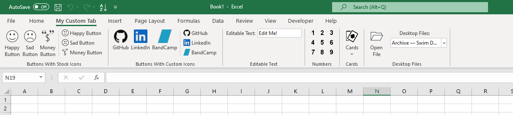

# Example Ribbon Using The RibbonX Builder Library
This project creates an example ribbon using the RibbonX-Builder library. All (well, almost all) of ribbon creation code is contained inside the method 'BuildRibbon' in the 'Ribbon' class.
The created ribbon uses a mix of static and dynamic content. It includes custom images for each button that are supplied at runtime. The output looks like this:

	

### Additional Steps To Run
1. Build the project.
2. Add the path to the freshly built .dll to the included .reg file.
3. Use the .reg file.
4. Project Properties > Debug > Start External Program > 'C:\Program Files\Microsoft Office\root\Office16\EXCEL.EXE' (If not already set.)
5. Run

Note to self: Automate the above steps in the future.